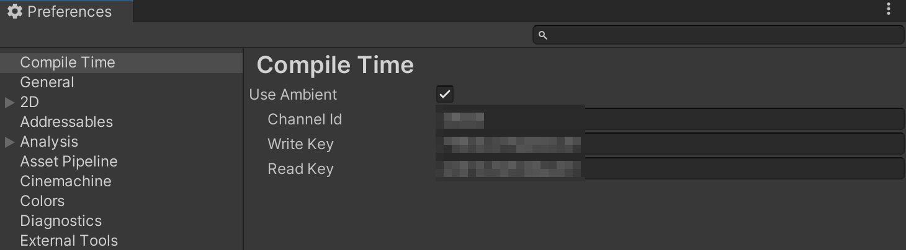

# ambient-unity-compile-time

ambient-unity-compile-time は Unity Editor のコンパイル時間を計測するツールです。
`Preference` ウィンドウで設定追記すると [Ambient](https://ambidata.io/) へ自動的に送信・データ集積することもできます。

## Installing

### プロジェクトへパッケージの追加

Unity の `Package Manager` から追加します。

1. `+` アイコンをクリック
2. `Add package from git URL...` をクリック
3. `git@github.com:kumak1/ambient-unity-compile-time.git` を入力

## Usage

インストールするだけで `Console` ウィンドウに Unity Editor のコンパイル時間が出力されます。 

`Preference` ウィンドウで [Ambient](https://ambidata.io/) の設定値を追記し `Use Ambient` のチェックを入れると、計測後に自動で Ambient に情報が送信されます。

